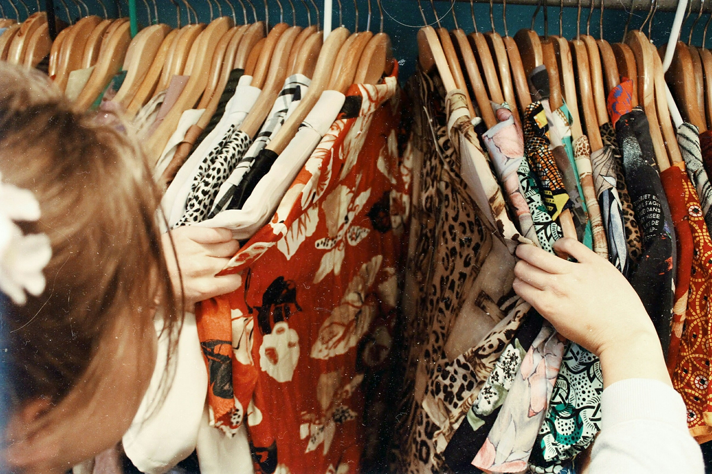

<div align="center">


# ReUse Web

**Dê novos ciclos ao que ainda tem muito para oferecer.**

Plataforma web para **comprar, trocar e doar** itens, aproximando pessoas e incentivando a reutilização.

[](https://nextjs.org/)
[](https://react.dev/)
[](https://www.prisma.io/)

**[Conheça o ReUse Mobile](https://github.com/isalvesb/ReUse)** · **[Explore o código Web](https://github.com/isalvesb/ReUse-Web)**

</div>

---

## ♻️ Sobre o projeto

O **ReUse** é uma plataforma de economia circular que ajuda objetos em bom estado a encontrarem novos destinos. As pessoas podem anunciar itens para **venda, troca ou doação**, descobrir produtos na Vitrine e conversar para combinar os detalhes.

A versão **Web** foi desenvolvida em contexto acadêmico e compartilha propósito, marca e equipe com o aplicativo **ReUse Mobile**, usando padrões de navegação adequados a cada plataforma.

<p align="center">
  
</p>

## 📱 O que já existe no ReUse Web

| Experiência | Recursos implementados |
| --- | --- |
| **Descoberta** | Home, categorias, curadorias, Vitrine pública, busca e filtros. |
| **Anúncios** | Publicação de itens para venda, troca ou doação, imagens, condição e localização. |
| **Negociação** | Detalhes do produto, perfil público do anunciante e chat vinculado aos itens. |
| **Conta** | Cadastro, login por e-mail, recuperação de senha, edição do perfil e Minha Vitrine. |
| **Personalização** | Foto própria ou seleção de avatar ilustrado, descrição “Sobre mim”. |
| **Acompanhamento** | Notificações internas e assistente no perfil autenticado. |
| **Institucional** | Página pública **Sobre**, layout responsivo e navegação acessível. |

> Algumas funcionalidades exigem PostgreSQL e serviços externos configurados. Implementação no código não equivale a validação de todos os fluxos em produção.

## 🧭 Experiência e decisões de interface

### Home e descoberta

A Home apresenta a proposta da plataforma, direciona às categorias e exibe uma seleção **demonstrativa** de anúncios. A área **“Produtos perto de você”** usa itens de **Bela Vista e Liberdade (São Paulo/SP)** no conjunto de demonstração; ela **não** calcula a localização de quem está navegando.

### Vitrine e produto

A Vitrine é pública: permite explorar anúncios, pesquisar e filtrar por categoria ou modalidade. Cada produto possui galeria, condição, localização, dados do vendedor e acesso ao fluxo de conversa, que exige autenticação.

### Perfil e Minha Vitrine

No perfil, o usuário pode apresentar sua biografia, configurar imagem ou avatar e administrar os próprios anúncios. As versões pública e privada mantêm a mesma identidade visual, mas respeitam permissões diferentes.

### Chat, notificações e assistente

As conversas são organizadas entre participantes e relacionadas a anúncios. O assistente oferece ajuda na Minha Vitrine e solicita confirmação antes de operações que modificam ofertas. O **classificador local** não deve ser confundido com uma conexão real ao **IBM Watson Assistant**.

### Sobre

A página pública `/sobre` apresenta a ideia do ReUse e o caminho entre publicar, encontrar, conversar e reutilizar, com uma composição editorial alinhada à identidade do aplicativo.

---

## 🎨 Identidade visual

A linguagem visual busca equilíbrio entre **acolhimento, confiança e modernidade**. Em vez do verde tradicional das marcas sustentáveis, o ReUse trabalha com contrastes de **creme, marrom e rosa/lilás**, formas arredondadas e fotografias de objetos cotidianos.

### ♾️ Marca e logotipo

O símbolo do ReUse utiliza círculos conectados, associados à continuidade, circulação, troca e comunidade. A identidade tipográfica da marca foi concebida com **Syne ExtraBold**; no Web, usamos também as versões oficiais da logo como imagem.

<p align="center">
  
</p>

### Paleta de cores

| Uso | Cor | Código |
| --- | --- | --- |
| Texto e estrutura principal | Marrom profundo | `#342A2A` |
| Variações estruturais | Marrom secundário | `#584C4C` |
| Apoio terroso | Bege | `#A0947A` |
| Fundo e áreas de respiro | Creme | `#F7EFDE` |
| Chamadas e estados de destaque | Rosa/lilás | `#EBBBEB` |

<p align="center">
  
</p>

A prancha acima é compartilhada com o projeto Mobile e inclui variações complementares. No Web, as cores efetivamente empregadas nos componentes podem variar por função e contraste.

### 🔤 Tipografia

- **Syne ExtraBold:** referência de construção do logotipo e da marca.
- **Inter:** textos de interface, botões, formulários e conteúdos informativos.
- **Outros destaques pontuais:** quando presentes, preservam a composição existente sem substituir a tipografia principal da interface.

<p align="center">
  
</p>

### 🖌️ Ilustrações e imagens

As ilustrações institucionais usam traços simples e monocromáticos, com figuras e situações cotidianas. A fotografia editorial e as imagens dos anúncios complementam essa linguagem, sem competir com os conteúdos de compra, troca e doação.

<p align="center">
  
</p>

<p align="center">
  
</p>

O Web utiliza também pranchas de produtos com recorte por **sprite**, reduzindo a duplicação de arquivos de imagens demonstrativas.

---

## 🛠️ Tecnologias utilizadas

| Camada | Tecnologias |
| --- | --- |
| Interface | Next.js 16 (App Router), React 19, JavaScript, Tailwind CSS 4, Swiper |
| Dados | Prisma ORM 6, PostgreSQL |
| Sessão e autenticação | Cookies assinados com `jose`, `bcryptjs`, OAuth Google/Facebook |
| Armazenamento e e-mail | Supabase Storage, Resend |
| Assistente | Classificador local e integração opcional preparada para IBM Watson Assistant |
| Qualidade | ESLint e Node Test Runner |

## 📁 Estrutura resumida

```text
ReUse-Web/
├── prisma/                  # Schema, migrations e seed demonstrativo
├── public/images/           # Marca, banners, itens, perfis e pranchas
├── src/
│   ├── app/                 # Rotas, páginas, APIs e ações de servidor
│   ├── components/          # Componentes compartilhados
│   └── lib/                 # Sessão, dados, imagens e integrações
├── tests/                   # Testes automatizados
├── docs/projeto/            # Orientações técnicas sobre Watson e deploy
├── package.json
└── README.md
```

## ⚙️ Como rodar localmente

**Pré-requisitos:** Node.js compatível com o projeto, npm e acesso a um PostgreSQL.

```bash
# 1. Clone o repositório e instale as dependências
git clone https://github.com/isalvesb/ReUse-Web.git
cd ReUse-Web
npm ci

# 2. Crie o arquivo local de configuração
cp .env.example .env

# 3. Configure o banco e os segredos locais no .env
#    Confira o banco correto antes de aplicar migrations.
npx prisma migrate status
npx prisma migrate deploy

# 4. Inicie a aplicação
npm run dev
```

Acesse **http://localhost:3000**. Não execute migrations em um banco já existente sem conferir previamente seu histórico e destino.

### Variáveis de ambiente

Use o arquivo [`.env.example`](.env.example) como referência. **Nunca versione o `.env` real.**

| Variável | Finalidade |
| --- | --- |
| `DATABASE_URL` | Conexão PostgreSQL do Prisma. |
| `SESSION_SECRET` | Segredo de sessão, com **pelo menos 32 caracteres**. |
| `ASSISTANT_CONFIRMATION_SECRET` | Assinatura das confirmações de ações do assistente. |
| `NEXT_PUBLIC_APP_URL` | URL-base usada pelos links e callbacks. |
| `GOOGLE_CLIENT_ID` / `GOOGLE_CLIENT_SECRET` | OAuth Google. |
| `FACEBOOK_CLIENT_ID` / `FACEBOOK_CLIENT_SECRET` | OAuth Facebook. |
| `RESEND_API_KEY` | Serviço de recuperação de senha por e-mail. |
| `SUPABASE_URL` / `SUPABASE_SERVICE_ROLE_KEY` / `SUPABASE_STORAGE_BUCKET` | Uploads persistentes no Storage. |
| `IBM_WATSON_*` | Configuração opcional do Watson Assistant. |
| `SEED_PASSWORD` | Senha local dos usuários demonstrativos. |
| `DEMO_SEED_ALLOWED` | Autorização explícita para executar o seed completo. |

### Banco e dados demonstrativos

O script em `prisma/seed.js` prepara categorias, **seis personagens**, anúncios, notificações e conversas de demonstração. A seção de itens próximos é uma **curadoria fixa de exemplo**, e não geolocalização automática.

Em ambiente demonstrativo **isolado e autorizado**, depois de revisar o banco de destino e os registros que serão alterados:

```bash
npm run db:seed:categories   # Apenas categorias
npm run db:seed              # Seed completo, com as proteções exigidas
```

O seed completo requer `DEMO_SEED_ALLOWED=true` e uma `SEED_PASSWORD` local de ao menos oito caracteres. Ele pode **atualizar contas demonstrativas existentes, inclusive seus hashes de senha, anúncios e imagens**. Não o execute em banco com contas reais sem uma auditoria específica.

### Verificações

```bash
npm run lint
npm test
npm run build
# ou: npm run check
```

Os testes automatizados cobrem regras do assistente, confirmações, OAuth, tokens de redefinição e validação de uploads. Serviços externos e jornadas completas ainda exigem testes próprios no ambiente configurado.

## 🔌 Integrações e publicação

| Integração | Estado documentado |
| --- | --- |
| **PostgreSQL via Supabase** | Banco relacional separado do serviço de Storage; a conexão e o histórico de migrations devem ser conferidos em cada ambiente. |
| **Supabase Storage** | Código de upload persistente; funcionamento depende das credenciais e do bucket do ambiente. |
| **Resend** | Fluxos de recuperação implementados; validação de envio depende do ambiente configurado. |
| **Google OAuth** | Redirecionamento, `state` e callback verificados localmente; **login completo com conta real ainda pendente de comprovação**. |
| **Facebook OAuth** | Fluxo implementado; conclusão de sessão não revalidada nesta versão. |
| **IBM Watson Assistant** | Integração preparada, mas **sem evidência de resposta real do Watson**. |
| **Deploy** | Nenhum ambiente publicado é considerado validado somente pelo build local. |

Para publicar, é necessário validar URL, segredos de sessão, banco, callbacks OAuth, Storage e fluxos de autenticação no ambiente de destino. Consulte [as orientações de deploy](docs/projeto/deploy.md) e [a documentação do assistente](docs/projeto/watson.md).

---

## 👥 Equipe ReUse

<div align="center">
<table>
<tr>
<td align="center"><br><b>Mirna Marinho</b><br><a href="https://github.com/amimarinho">GitHub</a> · <a href="https://www.linkedin.com/in/amimarinho/">LinkedIn</a></td>
<td align="center"><br><b>Guilherme Cunha</b><br><a href="https://github.com/guicunhasou">GitHub</a> · <a href="https://www.linkedin.com/in/guicunhasou/">LinkedIn</a></td>
<td align="center"><br><b>Kauane Cavalcante</b><br><a href="https://github.com/kaucavalcante">GitHub</a> · <a href="https://www.linkedin.com/in/kauanecavalcante">LinkedIn</a></td>
<td align="center"><br><b>Isa Alves</b><br><a href="https://github.com/isalvesb">GitHub</a> · <a href="https://www.linkedin.com/in/isalvesb/">LinkedIn</a></td>
</tr>
</table>
</div>

---

<div align="center">
  <sub>ReUse Web e ReUse Mobile: a mesma proposta de dar continuidade às histórias dos objetos.</sub>
</div>
